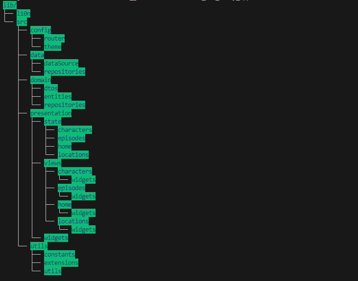

# Rick And Morty APP

A flutter project that implements Rick and Morty API.

## Make it run

To make it run you need to configure `HOST` environment var on compiling app, you can do it on terminal or in `.vscode/launch.json`. You need to set that file with this content:

        // Visual studio launch.json file content
        {
            "version": "0.2.0",
            "configurations": [
                {
                    "name": "rick_and_morty_app",
                    "request": "launch",
                    "type": "dart",
                    "toolArgs": [
                        "--dart-define",
                        "HOST=https://rickandmortyapi.com",
                    ],
                    "args": [
                        "--dart-define=HOST=https://rickandmortyapi.com",
                    ],
                    "env": {
                        "HOST": "https://rickandmortyapi.com",
                    }
                },
                {
                    "name": "rick_and_morty_app (profile mode)",
                    "request": "launch",
                    "type": "dart",
                    "flutterMode": "profile",
                    "toolArgs": [
                        "--dart-define",
                        "HOST=https://rickandmortyapi.com",
                    ],
                    "args": [
                        "--dart-define=HOST=https://rickandmortyapi.com",
                    ],
                    "env": {
                        "HOST": "https://rickandmortyapi.com",
                    }
                },
                {
                    "name": "rick_and_morty_app (release mode)",
                    "request": "launch",
                    "type": "dart",
                    "flutterMode": "release",
                    "toolArgs": [
                        "--dart-define",
                        "HOST=https://rickandmortyapi.com",
                    ],
                    "args": [
                        "--dart-define=HOST=https://rickandmortyapi.com",
                    ],
                    "env": {
                        "HOST": "https://rickandmortyapi.com",
                    }
                }
            ]
        }

With that you can run Rick and Morty APP with any issues.

## State management

Riverpod is used to manage app state, using providers to get and update widgets state.

## Multi-language support

App supports using and selecting two languages `EN and ES`. You can add any other language just adding a file on ``lib/l10n/app_[NewLang].arb` and adding the respective traduction.

## APP folder structure

  

